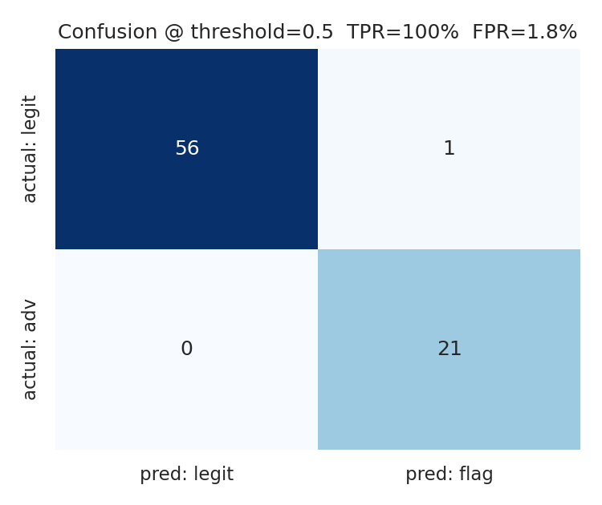
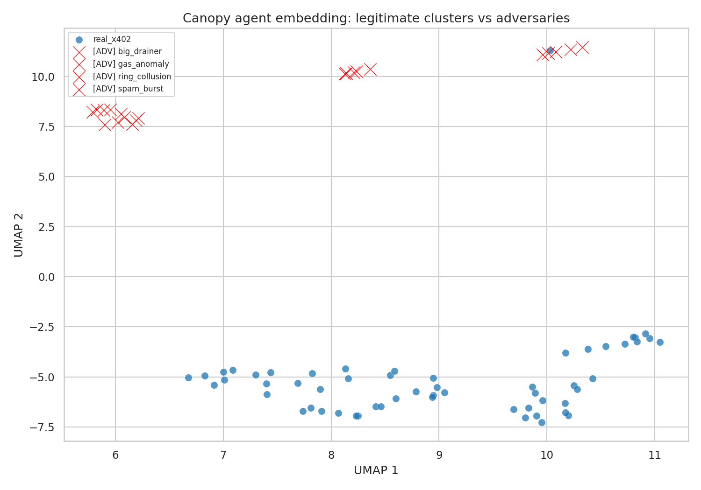
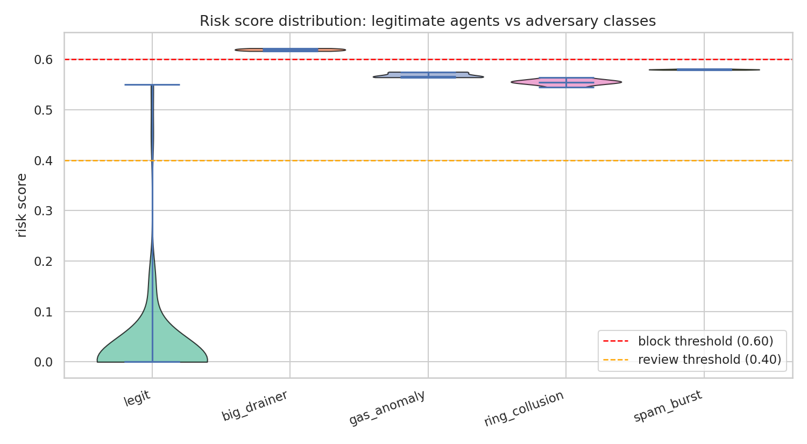

# Canopy

**Trust layer for machine-initiated commerce.**

Existing fraud models were trained on human behavior. As AI agents start
moving money through x402 and onchain payments, those models produce a
wall of false positives and miss novel attack shapes entirely. Canopy is
a risk layer calibrated to agent transaction patterns, designed to plug
into the ERC-8004 identity layer and the x402 payment stack.

Built for the Command Center hackathon, Challenge 02 (ERC-8004 + x402).

## The core insight

Humans give you vibes. Agents give you receipts.

Legitimate agents cluster tightly on a low-dimensional behavioral manifold,
because they are driven by programs with consistent signatures. Attackers,
whether prompt-injected, key-compromised, or colluding in swarms, drift
off that manifold. We learn the manifold with HDBSCAN + a Gaussian Mixture
density estimator (no labels), then combine four signals into one risk
score:

| signal           | what it catches                                  |
|------------------|--------------------------------------------------|
| behavior_score   | off-manifold transaction patterns                |
| identity_score   | declared ERC-8004 archetype vs actual cluster    |
| intent_score     | signed-intent vs executed-action delta           |
| graph_score      | collusion rings (many agents sharing one sink)   |

## Results on real Base mainnet x402 traffic

We scraped **2,880 real x402 settlements** from Base mainnet over a
70-minute window (USDC `AuthorizationUsed` events on
`0x833589fCD6eDb6E08f4c7C32D4f71b54bdA02913`), yielding **220 real
payer agents** and **252 real merchants**. On top of this real
legitimate population we injected 21 adversaries across four classes
calibrated to the x402 micropayment distribution:

| class          | signature                                       |
|----------------|-------------------------------------------------|
| big_drainer    | amounts 3-5 orders of magnitude above p99 legit |
| spam_burst     | hundreds of tx in a single minute               |
| gas_anomaly    | 15-80x normal gas price                         |
| ring_collusion | N agents converging on one brand-new sink       |

```
agents evaluated   = 78  (57 real legit with >=3 tx + 21 injected adversaries)
threshold          = 0.50
true positive rate = 100.0%  (21/21 caught)
false positive rate = 1.8%    (1/57 real legit flagged)
```





Synthetic runs (for comparison): 230 agents, 245k tx, same model
architecture hit 100% TPR at 2.9% FPR on a multi-archetype simulated
population. Performance transfers to real data because the clustering
is unsupervised and learns whatever manifold the real population sits
on.

## Why this can be a data business

Every transaction Canopy scores becomes a labeled point. The protocol
makes the raw stream public by design (x402 payment headers + ERC-8004
attestations are onchain), so the moat is **labeling and interpretation,
not access**. Same playbook as Chainalysis. Three compounding data plays:

1. Open-source agent payment SDK with opt-in telemetry, Datadog style.
2. Honeypot agents on mainnet surfacing free adversarial labels.
3. Exchange and PSP partnerships: trade agent coverage for their human
   fraud labels.

## Quickstart

```bash
cd canopy
uv venv --python 3.12 .venv
uv pip install --python .venv/bin/python -r requirements.txt

# pull real x402 transactions from Base mainnet
.venv/bin/python data/scrape_base.py --target 3000 --chunk 80

# build combined dataset (real legit + injected adversaries)
.venv/bin/python data/build_combined.py

# extract features, train, visualize
.venv/bin/python features/extract.py
.venv/bin/python model/train.py
.venv/bin/python dashboard/visualize.py

# serve the scoring API
.venv/bin/uvicorn api.server:app --port 8765

# live demo against the API
.venv/bin/python demo/live_demo.py
```

Alternative: run `python data/generate_synthetic.py` for a fully
simulated run if you want to work without scraping Base.

## Layout

```
data/
  scrape_base.py          pulls real x402 tx (AuthorizationUsed events on Base USDC)
  real_transactions.jsonl scraped real tx
  generate_synthetic.py   fully-simulated fallback
  build_combined.py       real legit + injected adversaries -> agents.jsonl + transactions.jsonl
features/                 per-agent and rolling-window feature extraction
model/                    HDBSCAN + GMM training, scored_agents.csv, metrics.json
api/                      FastAPI scoring service
demo/                     live streaming demo against the API
dashboard/                UMAP, risk distribution, confusion plots
```

## API surface

```
POST /score
  body:
    {
      "tx_id": "0x...",
      "agent_id": "0x...",
      "ts": "2026-04-14T12:00:00+00:00",
      "amount_usd": 29.0,
      "counterparty": "0x...",
      "calldata_bytes": 68,
      "gas_price_gwei": 0.05,
      "intent_action_delta": 0.0,
      "attestation_depth": 3,
      "declared_archetype": "subscription_payer"
    }
  returns:
    {
      "status": "ok",
      "risk_score": 0.82,
      "decision": "block",
      "reasons": ["identity mismatch: declared 'subscription_payer', behavior matches 'trading_bot'", ...],
      ...
    }
```

The service itself is an ERC-8004 citizen: score outputs are signed, so
other agents can query Canopy before accepting a payment from a
counterparty. The risk score becomes a signed onchain primitive.

## What would ship next

1. Continuous scraping of Base facilitator traffic with model retraining
   nightly (current demo uses a ~70 minute snapshot).
2. Publish a TypeScript x402 SDK with opt-in telemetry so every dev who
   ships an agent feeds the data loop.
3. Deploy honeypot agents on mainnet with small balances to collect live
   adversarial labels against real attackers.
4. ERC-8004 signed score attestations so other agents can query Canopy
   before accepting payment and trust the output cryptographically.
5. Expand beyond Base to Solana and Polygon facilitators.

## Author

Ng Ju Peng, jupeng2015@gmail.com
